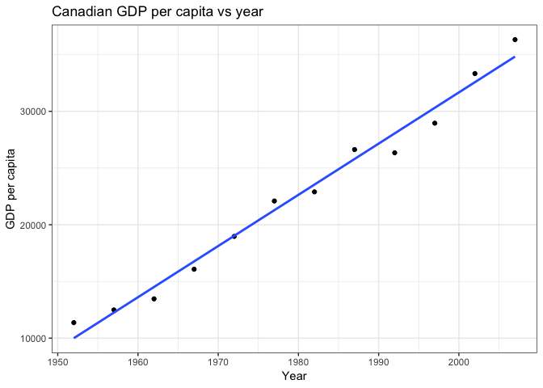
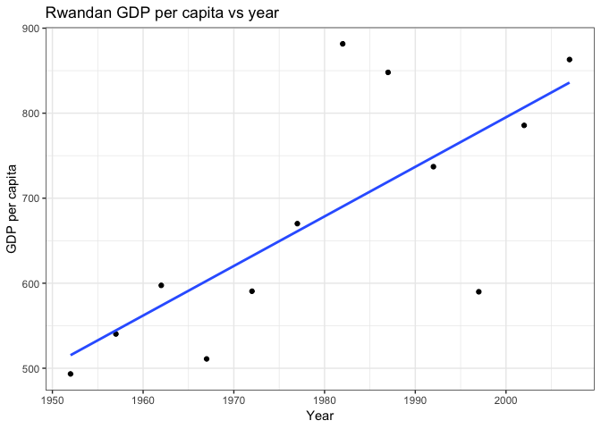

Homework Assignment \#6 for STAT 547
================

Comparing a function for linear regression vs robust linear regression of life expectancy on GDP per capita
-----------------------------------------------------------------------------------------------------------

-   Overview
-   Loading required packages
-   Creating a filtered uni-country test dataset and plotting
-   Creating a regular and robust linear regression model for our filtered data
-   Comparing robust and regular linear regression
-   Expanding our model to fit multi-country data

#### Overview

To fufill prompt \#2, we are going to build a function that can take in data on multiple countries and create a linear regression model for predicting life Expectancy based on GDP per capita

#### Loading required packages

``` r
suppressPackageStartupMessages(library(gapminder))
suppressPackageStartupMessages(library(tidyverse))
suppressPackageStartupMessages(library(dplyr))
suppressPackageStartupMessages(library(broom))
suppressPackageStartupMessages(library(DMwR))
suppressPackageStartupMessages(library(MASS))
```

#### Creating a filtered uni-country dataset and plotting

We will choose Canada for this example, and use dplyr methods to extract this information from the gapminder dataset. Additionally, we can see the rational for looking at life expectancy and GDP per capita, they are positively correlated.

``` r
can_gap <- gapminder %>%
  filter(country == "Canada") #filtered dataset for Canada

ggplot(can_gap, aes(gdpPercap, lifeExp)) + 
  geom_point() + 
  geom_smooth(method = "lm", se = FALSE) #linear model to fit scatterplot of lifeExp vs gdpPercap
```



#### Creating a robust and regular linear regression model for our filtered data

Here, we create our models as functions. Firstly, our linear regression model takes in data and has a starting year (1945 in this case). We create a variable, `fit`, to create a linear model of life expectancy and GDP per capita beginning in the starting year. Then we simply set the names of our linear model values to intercept and slope. Next, repeat this but using the robust linear model function.

``` r
lin_reg_mod <- function(data, starting_year = 1945) {
  fit <- lm(lifeExp ~ I(year - starting_year), data)
  setNames(data.frame(t(coef(fit))), c("intercept","slope"))
}

rob_lin_mod <- function(data, starting_year = 1945) {
  fit <- rlm(lifeExp ~ I(year - starting_year), data)
  setNames(data.frame(t(coef(fit))), c("intercept","slope"))
}

knitr::kable(lin_reg_mod(can_gap))
```

|  intercept|      slope|
|----------:|----------:|
|   67.35176|  0.2188692|

``` r
knitr::kable(rob_lin_mod(can_gap))
```

|  intercept|      slope|
|----------:|----------:|
|   67.35342|  0.2188468|

#### Comparing robust and regular linear regression

First off, lets use the `regr.eval()` method from the DMwR package to calculate the absolute error (mae), mean squared error (mse), root mean squared error (rmse) and other relative measures of error (mape)

``` r
regr.eval(can_gap$lifeExp, lin_reg_mod(can_gap))
```

    ##          mae          mse         rmse         mape 
    ##   5.92828077 405.48169931  20.13657616   0.08476746

``` r
regr.eval(can_gap$lifeExp, rob_lin_mod(can_gap))
```

    ##          mae          mse         rmse         mape 
    ##   5.92814417 405.48157254  20.13657301   0.08476547

This output tells us there is very little effect on all measures of error between linear regression models. But this could be due to the test data so lets try this test again with another test data set from Rwanda.

``` r
test_rwanda <- gapminder %>%
  filter(country == "Rwanda")

regr.eval(test_rwanda$lifeExp, lin_reg_mod(test_rwanda))
```

    ##          mae          mse         rmse         mape 
    ##   3.71738337 144.61972220  12.02579404   0.08980613

``` r
regr.eval(test_rwanda$lifeExp, rob_lin_mod(test_rwanda))
```

    ##          mae          mse         rmse         mape 
    ##   3.62972341 143.66065010  11.98585208   0.08762052

Here, we see the results we expected. Robust linear regression has lower measures of error because it weighs down outlier observations from skewing the model too much. Knowing Rwanda has some outliers in life expectancy seen below in the plot of life expectancy vs gdp per capita, robust linear was effective. Now lets extrapolate this model to take multi-country datasets.

``` r
ggplot(test_rwanda, aes(gdpPercap, lifeExp)) +
  geom_point() +
  geom_smooth(method = "lm", se = FALSE)
```



#### Expanding our model to fit multi-country data

Here, lets use the `do()` method in combination with the `group_by()` method that will group input data by country. The `do()` method will apply our previously defined robust linear regression function to all observations within a given country and repeat this for every country. We can see from the first few observations that we know have the slope and intercept of our linear regression model for every country.

``` r
rob_lin_all <- function(data) {
  data %>%
    group_by(country) %>%
    do(rob_lin_mod(.))
}

head(rob_lin_all(gapminder))
```

    ## Warning in rlm.default(x, y, weights, method = method, wt.method =
    ## wt.method, : 'rlm' failed to converge in 20 steps

    ## Warning in rlm.default(x, y, weights, method = method, wt.method =
    ## wt.method, : 'rlm' failed to converge in 20 steps

    ## Warning in rlm.default(x, y, weights, method = method, wt.method =
    ## wt.method, : 'rlm' failed to converge in 20 steps

    ## # A tibble: 6 x 3
    ## # Groups:   country [6]
    ##   country     intercept slope
    ##   <fct>           <dbl> <dbl>
    ## 1 Afghanistan      28.0 0.275
    ## 2 Albania          57.7 0.316
    ## 3 Algeria          39.1 0.576
    ## 4 Angola           30.7 0.209
    ## 5 Argentina        61.0 0.233
    ## 6 Australia        66.8 0.228
